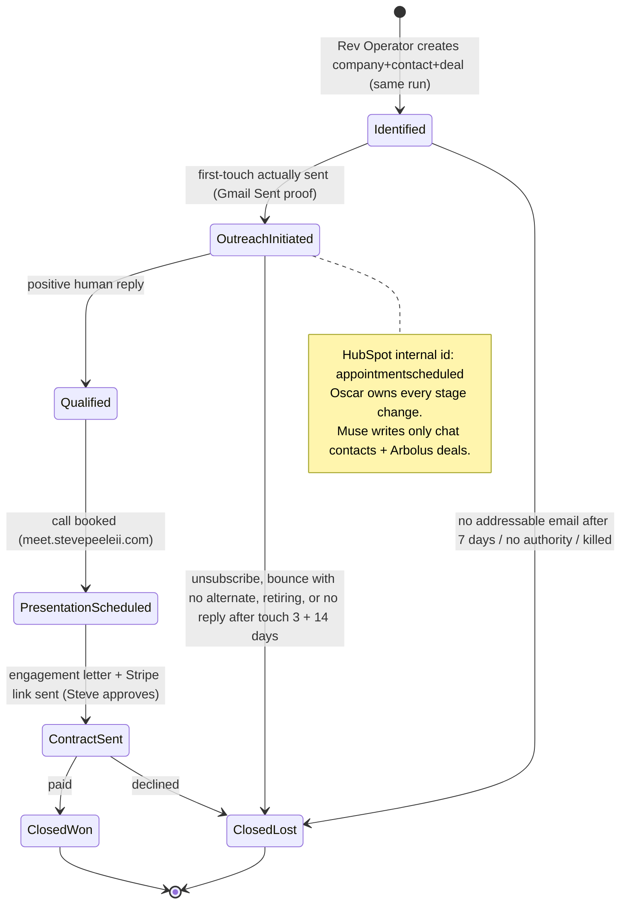
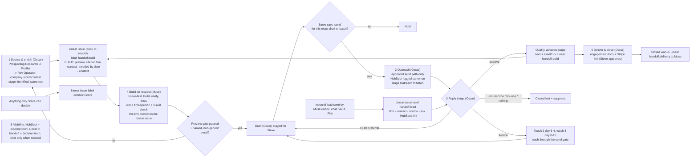
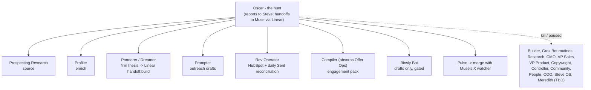
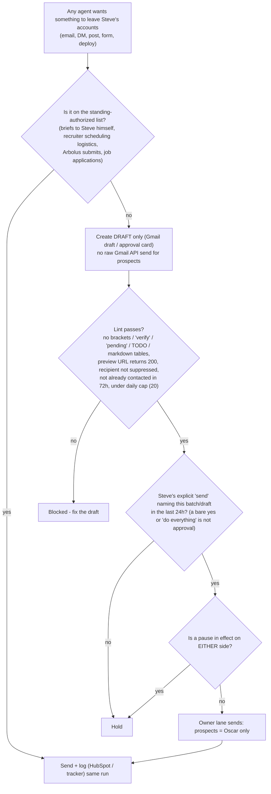

## hubspot-stages.mmd

```mermaid
stateDiagram-v2
  [*] --> Identified: Rev Operator creates company+contact+deal (same run)
  Identified --> OutreachInitiated: first-touch actually sent (Gmail Sent proof)
  Identified --> ClosedLost: no addressable email after 7 days / no authority / killed
  OutreachInitiated --> Qualified: positive human reply
  OutreachInitiated --> ClosedLost: unsubscribe, bounce with no alternate, retiring, or no reply after touch 3 + 14 days
  Qualified --> PresentationScheduled: call booked (meet.stevepeeleii.com)
  PresentationScheduled --> ContractSent: engagement letter + Stripe link sent (Steve approves)
  ContractSent --> ClosedWon: paid
  ContractSent --> ClosedLost: declined
  ClosedWon --> [*]
  ClosedLost --> [*]
  note right of OutreachInitiated
    HubSpot internal id: appointmentscheduled
    Oscar owns every stage change.
    Muse writes only chat contacts + Arbolus deals.
  end note
```

## hunt-on-triage.mmd

```mermaid
flowchart LR
  T1["1 Source & enrich (Oscar)<br/>Prospecting Research -> Profiler<br/>-> Rev Operator: company+contact+deal<br/>stage Identified, same run"] --> LB
  LB["Linear issue (book of record)<br/>label handoff:build<br/>BUILD: preview site for firm - contact - needed by date - context"] --> T4a
  T4a["4 Build on request (Muse)<br/>Linear-first, build, verify, docs<br/>200 + firm-specific + visual check<br/>live link posted on the Linear issue"] --> G1
  G1{"Preview gate passed<br/>+ named, non-generic email?"} -- no --> T1
  G1 -- yes --> D["Draft (Oscar) staged for Steve"]
  D --> G2{"Steve says 'send'<br/>for this exact draft or batch?"}
  G2 -- no --> H["Hold"]
  G2 -- yes --> T2["2 Outreach (Oscar)<br/>approved send path only<br/>HubSpot logged same run<br/>stage Outreach Initiated"]
  T2 --> T3{"3 Reply triage (Oscar)"}
  T3 -- positive --> Q["Qualify, advance stage<br/>needs asset? -> Linear handoff:build"]
  Q --> LB
  T3 -- OOO / referral --> D
  T3 -- unsubscribe / bounce / retiring --> L["Closed lost + suppress"]
  T3 -- silence --> F["Touch 2 day 3-4, touch 3 day 8-10<br/>each through the send gate"]
  F --> D
  Q --> T5["5 Deliver & close (Oscar)<br/>engagement docs + Stripe link (Steve approves)"]
  T5 --> W["Closed won -> Linear handoff:delivery to Muse"]
  IN["Inbound lead seen by Muse (inbox, chat, Vault, PH)"] --> LL["Linear issue label handoff:lead<br/>firm - contact - source - ask - HubSpot link"] --> T3
  DEC["Anything only Steve can decide"] --> LD["Linear issue label decision:steve"]
  T6["6 Visibility: HubSpot = pipeline truth; Linear = handoff + decision truth; chat only when needed"]
```

## oscar-team.mmd

```mermaid
flowchart TD
  O["Oscar - the hunt<br/>(reports to Steve; handoffs to Muse via Linear)"]
  O --> PR["Prospecting Research<br/>source"]
  O --> PF["Profiler<br/>enrich"]
  O --> PD["Ponderer / Dreamer<br/>firm thesis -> Linear handoff:build"]
  O --> PM["Prompter<br/>outreach drafts"]
  O --> RO["Rev Operator<br/>HubSpot + daily Sent reconciliation"]
  O --> CO["Compiler (absorbs Offer Ops)<br/>engagement pack"]
  O --> BB["Binsly Bot<br/>drafts only, gated"]
  O --> PU["Pulse -> merge with Muse's X watcher"]
  O -.kill / paused.-> K["Builder, Grok Bot routines, Research, CMO, VP Sales,<br/>VP Product, Copywright, Controller, Community,<br/>People, COO, Steve OS, Meredith (TBD)"]
```

## send-guardrail.mmd

```mermaid
flowchart TD
  A["Any agent wants something to leave Steve's accounts<br/>(email, DM, post, form, deploy)"] --> B{"Is it on the standing-authorized list?<br/>(briefs to Steve himself, recruiter scheduling logistics,<br/>Arbolus submits, job applications)"}
  B -- yes --> L["Send + log (HubSpot / tracker) same run"]
  B -- no --> C["Create DRAFT only (Gmail draft / approval card)<br/>no raw Gmail API send for prospects"]
  C --> D{"Lint passes?<br/>no brackets / 'verify' / 'pending' / TODO / markdown tables,<br/>preview URL returns 200, recipient not suppressed,<br/>not already contacted in 72h, under daily cap (20)"}
  D -- no --> X["Blocked - fix the draft"]
  D -- yes --> E{"Steve's explicit 'send' naming this batch/draft<br/>in the last 24h? (a bare yes or 'do everything' is not approval)"}
  E -- no --> H["Hold"]
  E -- yes --> F{"Is a pause in effect on EITHER side?"}
  F -- yes --> H
  F -- no --> G["Owner lane sends: prospects = Oscar only"] --> L
```

